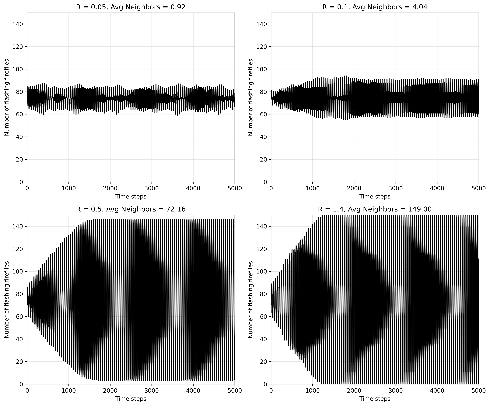
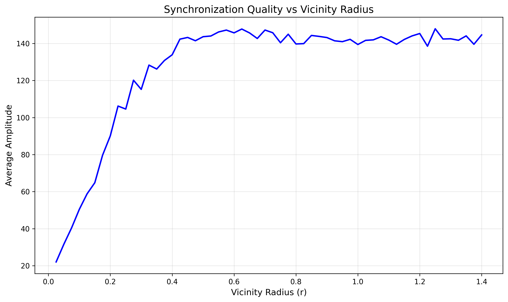

# Collective Robotics - Tutorial 1: Task 2

## Firefly Synchronization Simulation

### Group Members

- Bhavesh Gandhi, Jaqueline Machida

### Overview

This project implements a simulation of firefly synchronization behavior using a local majority rule. Fireflies are distributed randomly in a 1×1 square and synchronize their flashing cycles through local interactions with neighbors within a certain vicinity radius.

---

## Requirements

### Dependencies

- Python 3.7+
- NumPy
- Matplotlib

### Installation

```bash
pip install numpy matplotlib
```

---

## How to Run

### Task 2a: Flashing Over Time for Different Radii

```bash
python simulate_2a.py
```

This will:

- Run simulations for R ∈ {0.05, 0.1, 0.5, 1.4}
- Calculate average neighbors for each R
- Generate a 2×2 subplot showing flashing fireflies over 5000 timesteps
- Save plot as `task2a_flashing_over_time.png`

### Task 2b: Amplitude vs Vicinity Radius

```bash
python simulate_2b.py
```

This will:

- Run 50 independent simulations for each R ∈ [0.025, 1.4] (step 0.025)
- Calculate average amplitude for each R value
- Generate plot showing synchronization quality vs radius
- Save plot as `task2b_amplitude_vs_radius.png`

**Note:** Task 2b takes approximately 2-5 minutes to complete (2,800 total simulations).

---

## Implementation Details

### Firefly Synchronization Algorithm

**Initialization:**

1. Scatter N=150 fireflies uniformly in 1×1 square
2. Initialize clocks to random values in [0, L-1]
3. Cycle length L=50: flash for L/2=25 steps, dark for L/2=25 steps

**Each Timestep:**

1. **Observation Phase:**
   - Fireflies at clock=1 check their neighbors
   - Count neighbors within radius R
   - Apply local majority rule: if >50% of neighbors are flashing, mark for correction

2. **Correction Phase:**
   - Marked fireflies advance clock by +1 (in addition to normal tick)
   - This shortens current cycle by 1 step
   - Causes firefly to flash earlier next cycle

3. **Tick Phase:**
   - All fireflies advance clock by +1
   - Wrap clock to 0 when reaching L

---

## Results & Analysis

### Task 2a: Flashing Patterns Over Time



#### Observations

**R = 0.05 (Avg neighbors = 0.92)**

- Very low connectivity
- No clear synchronization pattern
- Random oscillation around 75 fireflies flashing
- Fireflies operate nearly independently

**R = 0.1 (Avg neighbors = 4.04)**

- Low connectivity
- Slight oscillation visible but weak
- Some local clustering but no global sync
- Still mostly random behavior

**R = 0.5 (Avg neighbors = 72.16)**

- Medium-high connectivity
- Clear synchronization emerges around t=1000
- Strong oscillation between ~0 and ~150
- Achieves stable synchronized flashing

**R = 1.4 (Avg neighbors = 149.00)**

- Very high connectivity (almost fully connected)
- Fastest synchronization (around t=1000-1500)
- Maximum amplitude oscillation (0 to 150)
- Most stable synchronized behavior

#### Key Finding

Synchronization requires sufficient connectivity. Below a critical threshold (~R=0.2-0.3), the swarm cannot achieve global synchronization.

---

### Task 2b: Synchronization Quality vs Vicinity Radius



#### Observations

The plot reveals three distinct regions:

**1. Low Radius (R < 0.3): Poor Synchronization**

- Amplitude rises steeply from ~20 to ~100
- Insufficient connectivity prevents global sync
- Only local clusters can synchronize

**2. Optimal Range (R ≈ 0.3 - 0.5): Best Performance**

- Amplitude plateaus at maximum (~140-148)
- Each firefly sees ~20-70 neighbors
- Sufficient for information propagation without noise

**3. High Radius (R > 0.5): Maintained Synchronization**

- Amplitude remains high (~140-145)
- Synchronization maintained but not improved
- High connectivity (100+ neighbors) doesn't add value
- Slight fluctuations due to averaging effects

---

**Question 1: What seems to be a good choice for the vicinity and swarm density?**

**Optimal vicinity radius: R ≈ 0.3 - 0.5**

Reasoning:

- Below R=0.3: Insufficient connectivity, poor synchronization
- R=0.3-0.5: Maximum synchronization with minimal connectivity cost
- Above R=0.5: No significant improvement, wasted sensing range

For this swarm density (150 fireflies in 1×1 square), **R ≈ 0.3-0.4** provides the best balance between:

- Sufficient neighbor count for reliable majority voting
- Efficient local communication (don't need to sense entire swarm)
- Robust synchronization behavior

**Question 2: What do low amplitudes tell us about synchronization, and what do high amplitudes reveal?**

- **Low amplitude (< 50):** Poor or no synchronization
  - Fireflies flash randomly, independently
  - Number flashing hovers around 75 (half the swarm)
  - No coordinated behavior

- **High amplitude (> 140):** Strong synchronization
  - Most/all fireflies flash together
  - Oscillation from ~0 to ~150 (nearly full swarm)
  - Coordinated collective behavior achieved

**Amplitude is a direct measure of synchronization quality!**

---

## Conclusions

1. **Emergent Synchronization:** Local interactions (majority rule) lead to global synchronization without central coordination

2. **Connectivity Threshold:** Minimum connectivity (R ≈ 0.3) required for synchronization to emerge

3. **Diminishing Returns:** Beyond R ≈ 0.5, additional connectivity doesn't improve synchronization

---
