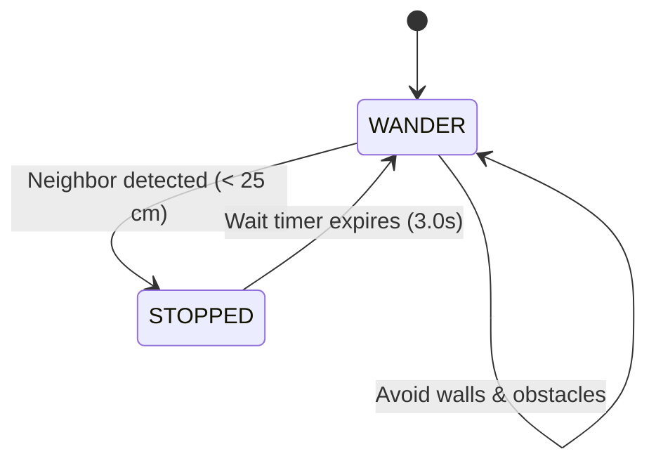
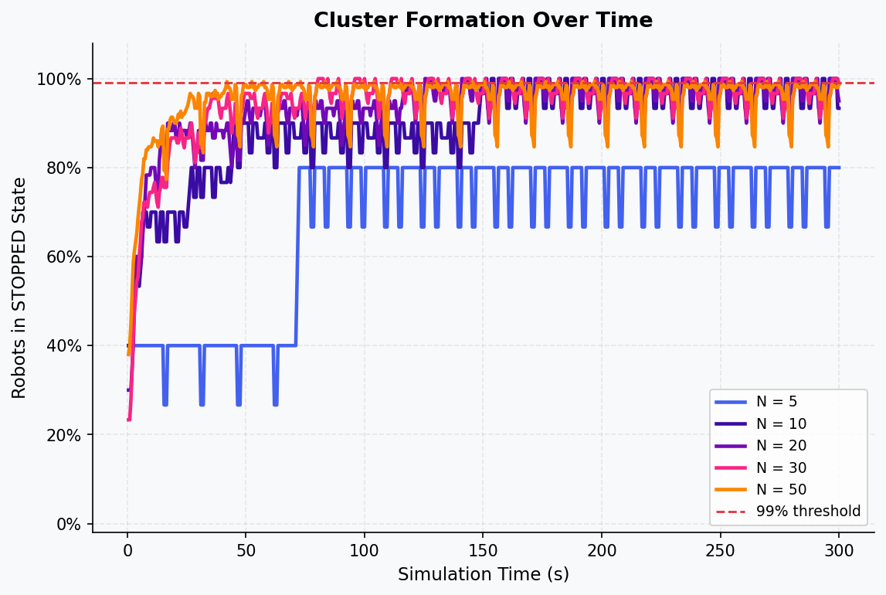
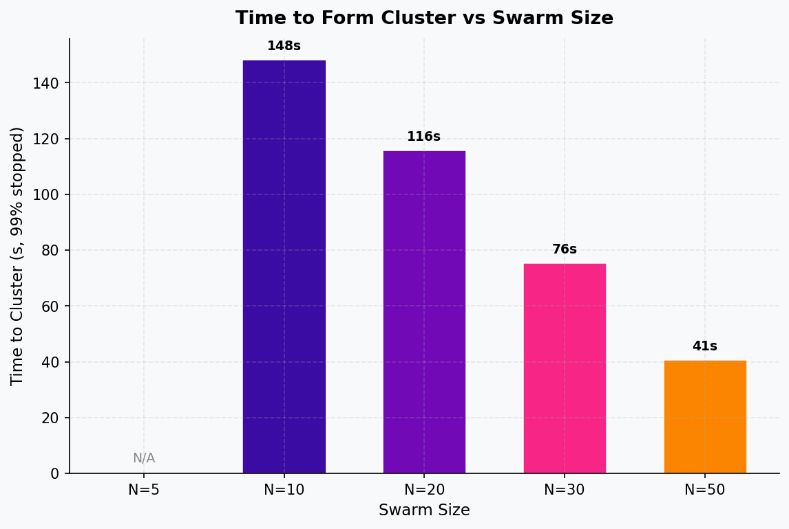
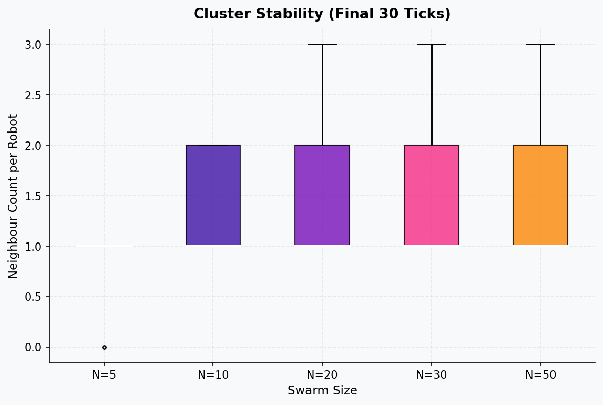

# Collective Robotics - Tutorial 2: Task 2

## Swarm Aggregation in ARGoS

### Group Members

- Bhavesh Gandhi, Jaqueline Machida

### Overview

This task implements and analyzes a decentralized **Swarm Aggregation** behavior using the **ARGoS 3** simulator and a two-state **Lua controller**. The swarm consists of simulated `foot-bot` robots operating in a closed $4\text{ m} \times 4\text{ m}$ arena. By employing a simple, decentralized local rule, where robots stop and wait upon detecting a neighbor, a global aggregation behavior emerges, causing the swarm to eventually gather into a single stable cluster. We analyze the speed and stability of this cluster formation under varying swarm sizes ($N \in \{5, 10, 20, 30, 50\}$).

## Requirements

### Prerequisites & Operating System

- **OS**: Ubuntu 22.04 LTS (or compatible Debian-based Linux distribution)
- **Python**: Python 3.7+ (with `pandas` and `matplotlib` for analysis and plotting)
- **Simulator**: ARGoS 3 (configured with Lua support)

### 1. ARGoS 3 Simulator Installation

To install ARGoS 3 from source on Ubuntu 22.04, first install the required compilation and visualization dependencies:

```bash
sudo apt-get update
sudo apt-get install cmake g++ git libfreeimage-dev libfreeimageplus-dev \
  freeglut3-dev libxi-dev libxmu-dev liblua5.3-dev lua5.3 doxygen graphviz \
  libgraphviz-dev asciidoc
```

*Note: If Qt-based GUI visualization is required, make sure the Qt 5 development packages for your distribution are also installed.*

Next, clone the repository, build the source code, and install the binaries:

```bash
git clone https://github.com/ilpincy/argos3.git argos3
cd argos3
mkdir build
cd build
cmake ../src
make
sudo make install
sudo ldconfig
```

Verify that the installation was successful and that `argos3` is accessible in your environment:

```bash
which argos3
argos3 --version
```

### 2. Python Environment Setup

The data-collection and plotting scripts require Python 3 along with `pandas` and `matplotlib` packages. It is recommended to use a virtual environment:

```bash
# Create and activate virtual environment
python3 -m venv collrob_env
source collrob_env/bin/activate

# Install required dependencies
pip install pandas matplotlib
```

## How to Run

Before running any commands, make sure you are inside the `Task 2` directory:

```bash
cd "CollRob_02_GANDHI_MACHIDA/Task 2"
```

### 1. Visual GUI Simulation

To view the interactive simulation in the graphical interface (with real-time 3D OpenGL visualization):

```bash
argos3 -c task2.argos
```

This runs the default experiment configuration loaded with **$N = 50$** foot-bots. In the GUI, you can play, pause, or step through the simulation to watch the robots wander and aggregate in real-time.

### 2. Headless Parameter Sweep (Varying Swarm Sizes)

To run the experiments across different swarm sizes and collect data for comparative analysis:

```bash
python3 run_experiments.py
```

This script automates the simulation pipeline by running the experiments headlessly (without GUI overhead) for swarm sizes **$N \in \{5, 10, 20, 30, 50\}$** for a duration of **$300\text{ seconds}$** (at $10\text{ ticks/second}$). 

For each run, the script:
- Dynamically patches the robot quantity in a temporary `.argos` file.
- Runs `argos3` headlessly (`-z` flag) and redirects logs.
- Outputs individual data files under `data/swarm_N<size>.csv` and a combined dataset at `data/all_runs.csv`.

### 3. Generate Analytical Plots

Once the experimental data is collected, process the CSVs and generate the comparative plots by running:

```bash
python3 plot_results.py
```

This script reads the generated CSV datasets and saves three analysis plots under the `plots/` directory:
- `plots/task2_stopped_over_time.png` (Aggregation kinetics over time)
- `plots/task2_time_to_cluster.png` (Time-to-cluster vs swarm size)
- `plots/task2_cluster_stability.png` (Cluster stability box plot)

## Implementation Details

The swarm aggregation behavior is implemented via a decentralized, two-state finite state machine (FSM) inside `task2.lua`.



### 1. Finite State Machine (FSM) States

- **`WANDER` State**:
  - The robot moves forward with a maximum velocity of $20\text{ cm/s}$.
  - It continuously checks all 24 infrared proximity sensors to steer away from obstacles (walls or other stopped robots) using a vector-based repulsion algorithm.
  - At each step, it queries the **Range-and-Bearing (RAB)** sensor. If any other robot is detected within `STOP_DISTANCE` ($25\text{ cm}$), the robot transitions to the `STOPPED` state and initializes a wait timer.
  - *LED Indicator*: **Green**

- **`STOPPED` State**:
  - The robot stops moving immediately by setting wheel velocities to $(0,0)$.
  - It decrements its waiting timer (`timer = WAIT_TICKS`, where $30\text{ ticks} = 3.0\text{ seconds}$).
  - Once the timer reaches $0$, it transitions back to the `WANDER` state to search for new aggregation centers.
  - *LED Indicator*: **Red**

### 2. Obstacle Avoidance Vector Math

Obstacle avoidance is computed using a virtual force vector field. Proximity sensor values $v_i \in [0, 1]$ and angles $\alpha_i$ are aggregated to form a repulsion vector:

$$\mathbf{F}_{\text{repulsion}} = -\sum_{i=1}^{24} \left( v_i \cos(\alpha_i)\mathbf{\hat{x}} + v_i \sin(\alpha_i)\mathbf{\hat{y}} \right)$$

- If the magnitude of $\mathbf{F}_{\text{repulsion}}$ is small ($< 0.05$), the robot drives straight at `MAX_VELOCITY` ($20\text{ cm/s}$).
- If an obstacle is detected, the robot steers towards the repulsion vector direction by adjusting the differential wheel velocities ($v_L, v_R$) using `TURN_GAIN = 2.0`, clamping the resulting velocities to $[-20, 20]\text{ cm/s}$ to ensure smooth avoidance maneuver.

## Results & Analysis

The generated dataset contains ~$69,000$ recorded data points across all runs. A cluster is defined as successfully formed when **$99\%$ of the swarm** is in the `STOPPED` state.

### 1. Cluster Formation Over Time



#### Observations
- **$N = 50$ (Dense Swarm)**: Displays extremely rapid aggregation. The stopped fraction rises sharply and achieves stable $100\%$ stopped status within $50\text{ seconds}$.
- **$N = 30$, $N = 20$, $N = 10$ (Medium Swarm)**: Display steady, reliable aggregation. They reach the cluster threshold progressively later, but maintain stability once clustered.
- **$N = 5$ (Sparse Swarm)**: Fails to aggregate. The stopped fraction oscillates randomly and never reaches the $99\%$ threshold. Encounter rates are too low to sustain a growing cluster or the arena size is too big for cluster formation.


---

### 2. Time to Cluster vs Swarm Size



#### Quantitative Summary

| Swarm Size ($N$) | Time to Cluster (seconds) |
| :--- | :---: |
| **$N = 5$** | *Did not cluster* (N/A) |
| **$N = 10$** | $148.5\text{ s}$ |
| **$N = 20$** | $116.0\text{ s}$ |
| **$N = 30$** | $75.5\text{ s}$ |
| **$N = 50$** | $41.0\text{ s}$ |

#### Key Finding
There is a non-linear relationship between swarm size and time to cluster. Increasing $N$ reduces the time to cluster exponentially. Because the arena size is fixed, a larger $N$ corresponds directly to higher swarm density, which increases the frequency of physical collisions and triggers positive feedback loops of stopping and clustering much earlier.

---

### 3. Cluster Stability

We analyze the stability of the cluster in the final $30\text{ ticks}$ ($3.0\text{ seconds}$) of the simulation by looking at the distribution of neighbor counts per robot.



#### Final-Window Neighbor Count Statistics

| Swarm Size ($N$) | Mean Neighbor Count | Median | Min | Max |
| :--- | :---: | :---: | :---: | :---: |
| **$N = 5$** | $0.80$ | $1.0$ | $0$ | $1$ |
| **$N = 10$** | $1.40$ | $1.0$ | $1$ | $2$ |
| **$N = 20$** | $1.40$ | $1.0$ | $1$ | $3$ |
| **$N = 30$** | $1.40$ | $1.0$ | $1$ | $3$ |
| **$N = 50$** | $1.44$ | $1.0$ | $1$ | $3$ |

#### Observations
- For all successful runs ($N \ge 10$), the median neighbor count is exactly $1$, with a minimum of $1$ and maximum of $2$ or $3$. This narrow distribution indicates a tight, stable aggregate where every robot remains in close contact with others.
- For $N = 5$, the minimum neighbor count drops to $0$, meaning that robots frequently drift away from each other and the cluster breaks down due to lack of local positive reinforcement.

## Discussion

### 1. How Swarm Size Affects Speed and Stability

Our findings demonstrate that **swarm density** is the primary driver of both the speed and stability of emergent aggregation:

- **Speed of Cluster Formation**: 
  As swarm size increases, the spatial density of the robots increases. Since the stopping behavior is triggered by proximity, a higher density increases the probability of initial random encounters. Once a few robots stop, they act as "nucleation sites." Wandering robots are highly likely to collide with these sites, stop, and expand the cluster. This positive feedback loop proceeds much faster in dense environments, explaining why $N=50$ aggregates $3.6\times$ faster than $N=10$.
  
- **Stability of the Cluster**: 
  In small swarms (e.g., $N=5$), the encounter rate is so low that the stopped timer (`WAIT_TICKS = 30`) often expires before another wandering robot joins the cluster. Consequently, stopped robots resume wandering, preventing the growth of a stable aggregate. In contrast, in large swarms, new robots continuously join the cluster at a rate faster than the stopped timers expire, creating a self-sustaining aggregate.

### 2. Emerging Swarm Behavior from Local Rules

This system shows how complex global structures emerge from simple, local rules without centralized control or global positioning:
1. **Local Rule**: Stop for $3\text{ seconds}$ if another robot is close; otherwise wander and avoid obstacles.
2. **Global Emergence**: A single, consolidated cluster forms. The stopped robots act as physical obstacles that other robots must steer around, increasing the density of robots in that area and triggering further stops.

## Conclusions

1. **Emergent Aggregation**: Localized, decentralized rules are highly effective for achieving global swarm aggregation without the need for central coordination or global maps.
2. **Swarm Density Threshold**: A critical swarm density (in this arena, $N \ge 10$) is necessary for stable aggregation to emerge. Below this threshold, stochastic drift and timeout expiration dissolve the clusters faster than they can grow.
3. **Density-Driven Speedup**: Increasing the swarm size reduces the time required to form a cluster non-linearly, making larger swarms highly robust and efficient at aggregation tasks.
