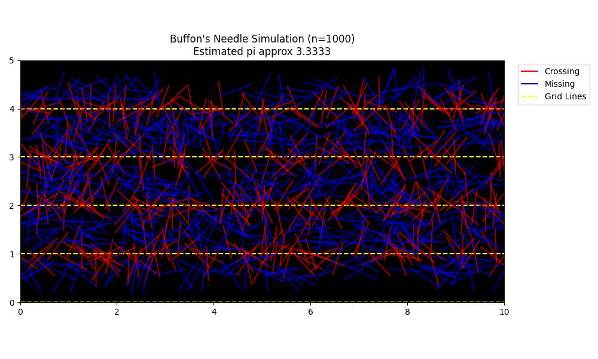
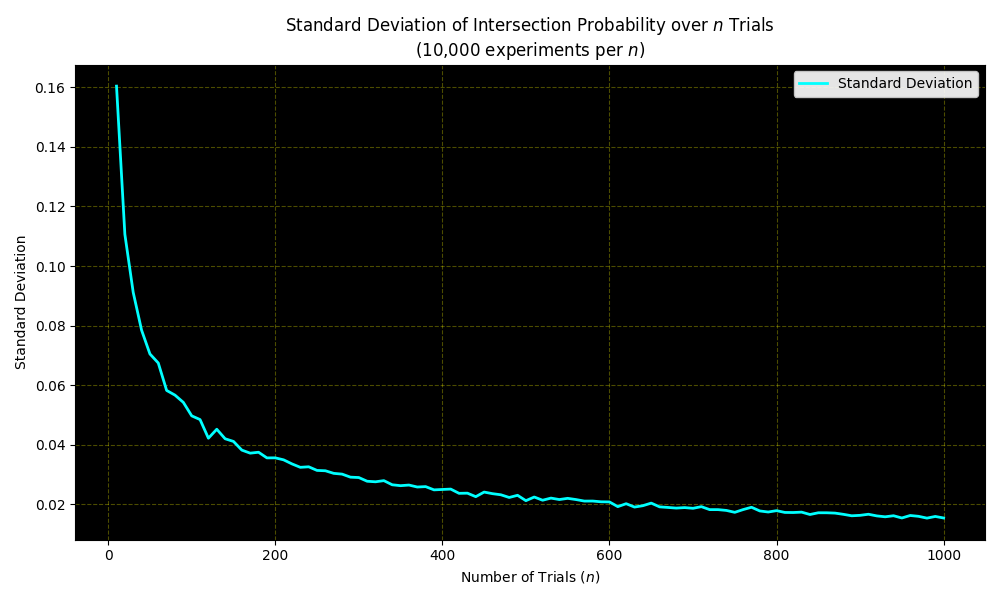
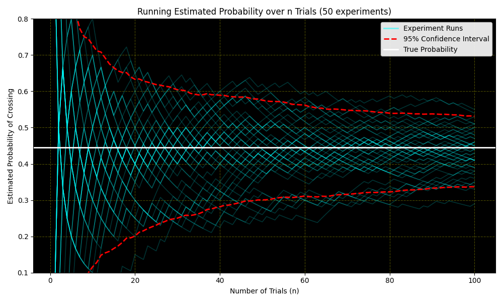
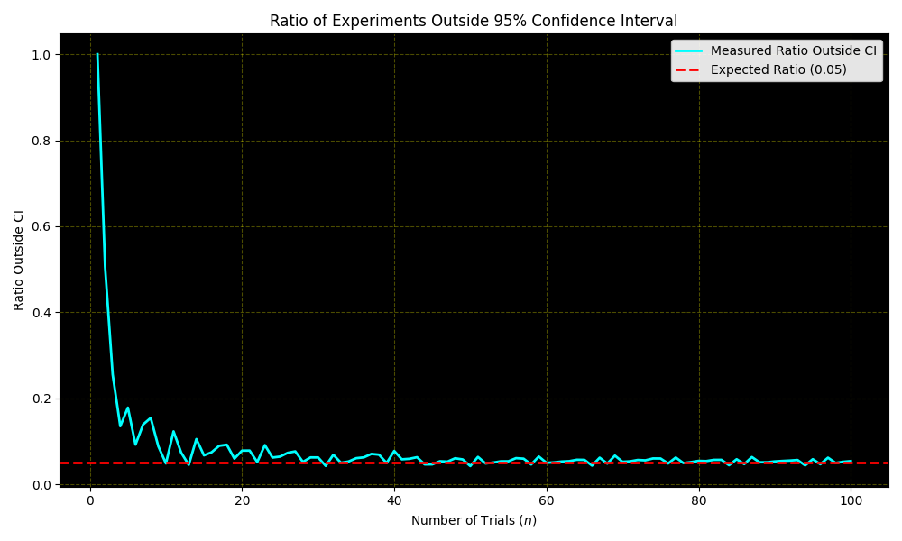

# Collective Robotics - Tutorial 3: Task 1

## Buffon's Needle Simulation

### Group Members

- Bhavesh Gandhi, Jaqueline Machida

### Overview

This task implements and analyzes **Buffon's Needle**, an experiment for estimating the intersection probability of a needle dropped on parallel lines and, from that probability, estimating $\pi$. The simulation uses a needle length of $L = 0.7$ and line spacing of $D = 1.0$, as requested in the assignment. Each needle drop is represented by two random variables: the distance $x$ from the needle center to the nearest line, and the angle $\theta$ between the needle and the parallel lines.

The task is divided into five parts:

- Derive the crossing probability $P$ and the corresponding estimator for $\pi$.
- Simulate $n = 1000$ needle drops and compare the estimated crossing probability with the theoretical probability.
- Study how the standard deviation of the estimated probability changes as the number of trials increases.
- Visualize the convergence of many running probability estimates with the binomial 95% confidence interval.
- Measure how often the true probability lies outside the measured confidence interval.

## Requirements

### Prerequisites & Operating System

- **OS**: Ubuntu 22.04 LTS, Windows, or any Python-compatible operating system
- **Python**: Python 3.7+
- **Python packages**: `numpy` and `matplotlib`

### Python Environment Setup

It is recommended to use a virtual environment before running the scripts:

```bash
python3 -m venv collrob_env
source collrob_env/bin/activate
pip install numpy matplotlib
```

On Windows PowerShell, the activation command is:

```powershell
.\collrob_env\Scripts\Activate.ps1
pip install numpy matplotlib
```

## How to Run

Before running any commands, make sure you are inside the `Task 1` directory:

```bash
cd "CollRob_03_GANDHI_MACHIDA/Task 1"
```

### 1. Single Buffon's Needle Simulation

To run the $n = 1000$ needle-drop simulation and generate the visual needle plot:

```bash
python3 task_1b.py
```

This script saves:

- `plots/1b_buffon_needle_simulation.png`

### 2. Standard Deviation Analysis

To run the repeated experiments for $n \in \{10, 20, \ldots, 1000\}$ and plot the standard deviation:

```bash
python3 task_1c.py
```

This script saves:

- `plots/1c_std_dev_vs_n.png`

### 3. Probability Convergence with Confidence Intervals

To plot the running crossing probability for 50 independent experiments up to $n = 100$:

```bash
python3 task_1d.py
```

This script saves:

- `plots/1d_probability_convergence.png`

### 4. Confidence Interval Coverage Test

To measure the ratio of experiments where the true crossing probability falls outside the 95% confidence interval:

```bash
python3 task_1e.py
```

This script saves:

- `plots/1e_ratio_outside_ci.png`

## Implementation Details

### 1. Geometric Model

The Buffon's Needle setup can be reduced to a local geometric problem because only the needle's distance from the nearest line and its angle matter. For a needle of length $L$ and line spacing $D$, with $L \le D$:

- $x$ is sampled uniformly from $[0, D/2]$.
- $\theta$ is sampled uniformly from $[0, \pi/2]$.

A crossing occurs when the vertical projection from the center of the needle to one tip reaches the nearest line:

$$x \le \frac{L}{2}\sin(\theta)$$

### 2. Derivation of Crossing Probability

The total sample-space area is:

$$A_{\text{total}} = \frac{D}{2}\cdot\frac{\pi}{2} = \frac{D\pi}{4}$$

The successful crossing region is:

$$A_{\text{success}} = \int_0^{\pi/2}\frac{L}{2}\sin(\theta)\,d\theta = \frac{L}{2}$$

Therefore, the theoretical crossing probability is:

$$P = \frac{A_{\text{success}}}{A_{\text{total}}} = \frac{2L}{D\pi}$$

Rearranging this equation gives the estimator for $\pi$:

$$\pi \approx \frac{2Ln}{DC}$$

where $n$ is the number of needle drops and $C$ is the number of crossings.

For the assignment values $L = 0.7$ and $D = 1.0$, the theoretical crossing probability is:

$$P_{\text{true}} = \frac{1.4}{\pi} \approx 0.4456$$

### 3. Confidence Interval

For a measured crossing probability $\hat{P}$ after $n$ trials, the binomial proportion 95% confidence interval is:

$$\hat{P} \pm 1.96\sqrt{\frac{1}{n}\hat{P}(1-\hat{P})}$$

This interval becomes narrower as $n$ increases because the uncertainty decreases approximately with $1/\sqrt{n}$.

## Results & Analysis

### 1. Single Buffon's Needle Simulation



#### Observations

- The red needles represent crossings, while the blue needles represent misses.
- The visual result matches the expected behavior: crossings occur when the needle center is close enough to a line and the angle creates enough vertical projection.
- In the plotted run, the estimated value of $\pi$ is approximately $3.3333$. This is higher than the true value of $\pi \approx 3.1416$, but this is expected for a single finite Monte Carlo run with $n = 1000$.
- The estimate is sensitive to the random number of crossings. Since $\pi$ is estimated as $\frac{2Ln}{DC}$, a slightly low crossing count produces a noticeably high $\pi$ estimate.

#### Key Finding

The single-run simulation confirms the geometric crossing condition and produces a reasonable Monte Carlo approximation, but one run is not enough to remove sampling noise. Accuracy improves when the number of trials or the number of repeated experiments increases.

---

### 2. Standard Deviation vs Number of Trials



#### Observations

- The standard deviation is high for small $n$, starting at roughly $0.16$ around $n = 10$.
- The curve decreases rapidly at first, then flattens as $n$ approaches $1000$.
- By $n = 1000$, the standard deviation is close to $0.015$, showing that repeated experiments produce much more consistent probability estimates.
- The decreasing curve follows the expected Monte Carlo behavior: the spread of a sample proportion scales approximately as

$$\sigma_{\hat{P}} = \sqrt{\frac{P(1-P)}{n}}$$

#### Key Finding

Increasing the number of needle drops reduces the variance of the estimated crossing probability. The improvement is strongest at small $n$, while later gains become more gradual because uncertainty shrinks with $1/\sqrt{n}$ rather than linearly.

---

### 3. Probability Convergence with 95% Confidence Intervals



#### Observations

- At very small $n$, the running probability estimates vary strongly because each individual crossing or miss has a large effect on the current average.
- As $n$ increases, the experiment trajectories begin to concentrate around the true probability line, $P_{\text{true}} \approx 0.4456$.
- The red dashed confidence interval bounds form a narrowing envelope around the estimates.
- The true probability remains near the center of the experiment cloud for larger $n$, which indicates that the estimator is unbiased in practice.

#### Key Finding

The plot illustrates convergence through repeated sampling. Individual experiments fluctuate heavily at first, but the measured probabilities stabilize near the theoretical probability as more trials are included.

---

### 4. Ratio Outside the 95% Confidence Interval



#### Observations

- At $n = 1$, the measured ratio outside the confidence interval is very high. This happens because the measured probability can only be $0$ or $1$, producing an extremely poor interval estimate.
- The outside ratio drops sharply within the first few trials as the measured probabilities become less degenerate.
- For larger $n$, the measured ratio fluctuates around the expected value of $0.05$.
- Small deviations from exactly $0.05$ are expected because the experiment uses a finite number of repetitions and because the interval is based on the normal approximation to a binomial distribution.

#### Key Finding

The 95% confidence interval behaves as expected once the number of trials is large enough. Approximately 5% of experiments exclude the true probability, which validates the confidence interval formula for moderate and larger sample sizes.

## Discussion

### 1. Effect of Number of Trials

The number of trials $n$ has the strongest influence on the quality of the estimate. With small $n$, the measured crossing probability is dominated by random fluctuations. Each individual needle drop changes the result substantially, so both $\hat{P}$ and the derived $\pi$ estimate can be far from their true values.

As $n$ increases, the law of large numbers becomes visible: the measured crossing probability converges toward the theoretical probability. Since the uncertainty of a binomial proportion decreases with $1/\sqrt{n}$, the standard deviation plot shows fast early improvement and slower later improvement.

### 2. Confidence Interval Interpretation

The confidence interval does not guarantee that every individual experiment contains the true probability. Instead, over many repeated experiments, a 95% confidence interval should exclude the true value about 5% of the time. The final plot confirms this interpretation: after the unstable early trials, the measured outside ratio remains close to the expected 0.05 line.

### 3. Estimating $\pi$ with Buffon's Needle

Buffon's Needle is a clear example of using local random sampling to estimate a global mathematical quantity. The simulation does not measure $\pi$ directly. Instead, it measures the crossing probability $P$, then uses the geometric relationship

$$\pi = \frac{2L}{DP}$$

to infer $\pi$. This means that any error in the measured probability is transformed into error in the $\pi$ estimate. Therefore, stable estimation of $\pi$ requires enough trials to make the crossing probability reliable.

## Conclusions

1. **Theoretical Result**: The crossing probability for Buffon's Needle is $P = \frac{2L}{D\pi}$, which can be rearranged to estimate $\pi$ from simulation data.
2. **Monte Carlo Accuracy**: A single simulation with $n = 1000$ gives a reasonable but noisy approximation. More trials are required for a consistently accurate estimate.
3. **Variance Reduction**: The standard deviation of the measured crossing probability decreases as the number of trials increases, approximately following the expected $1/\sqrt{n}$ Monte Carlo scaling.
4. **Convergence Behavior**: Running probability estimates initially fluctuate strongly but converge toward the true probability as more samples are collected.
5. **Confidence Interval Validation**: The measured ratio of experiments outside the 95% confidence interval approaches the expected value of $0.05$, confirming that the interval behaves correctly for sufficiently large $n$.
