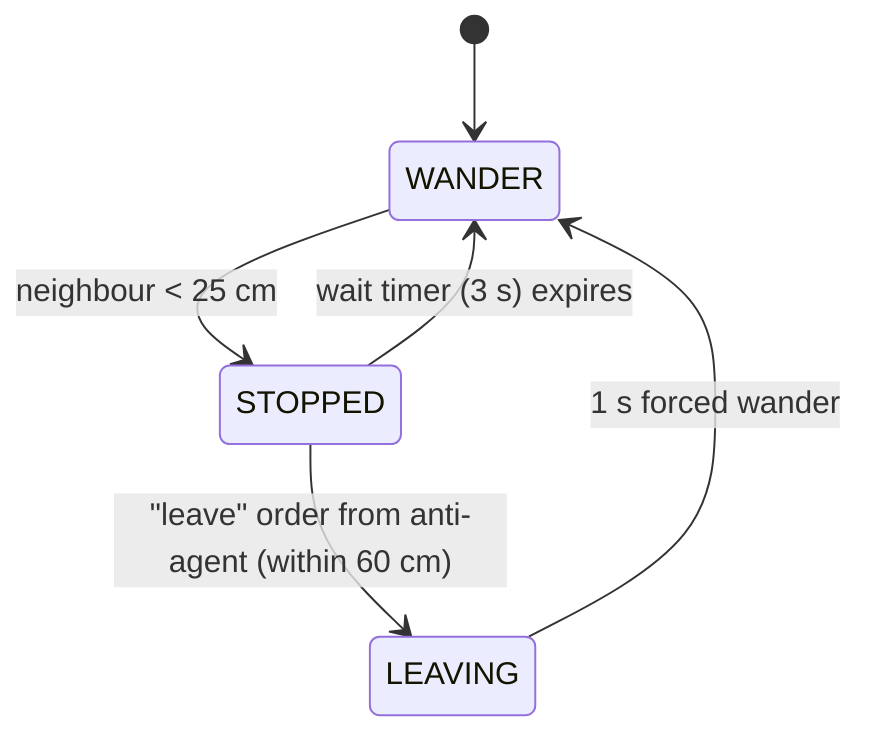
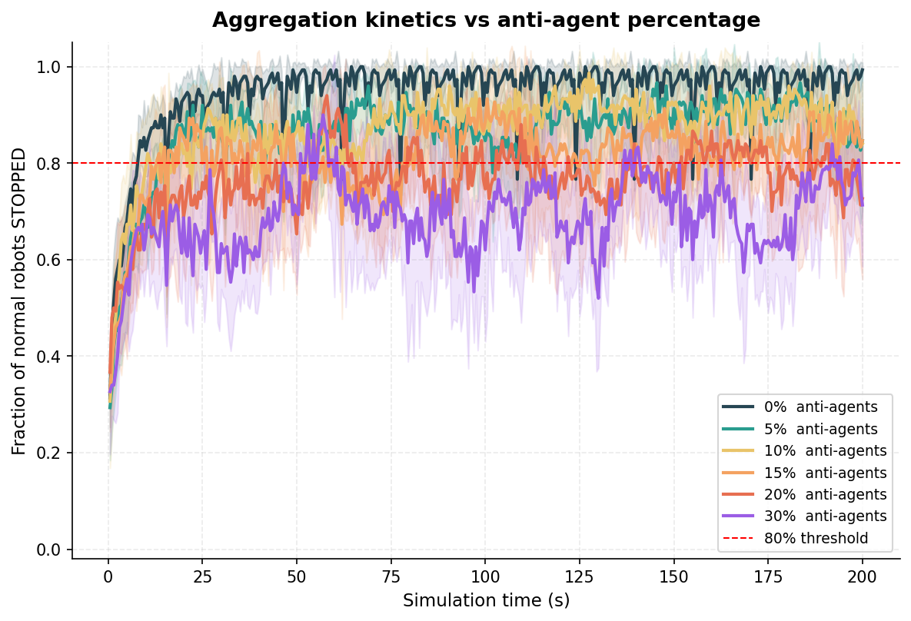
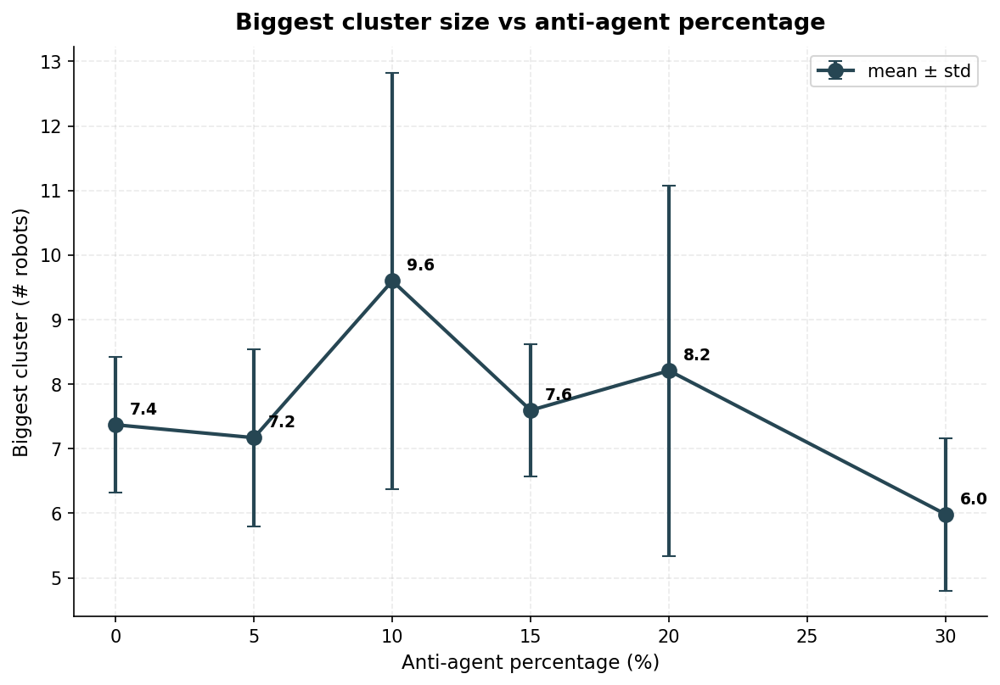
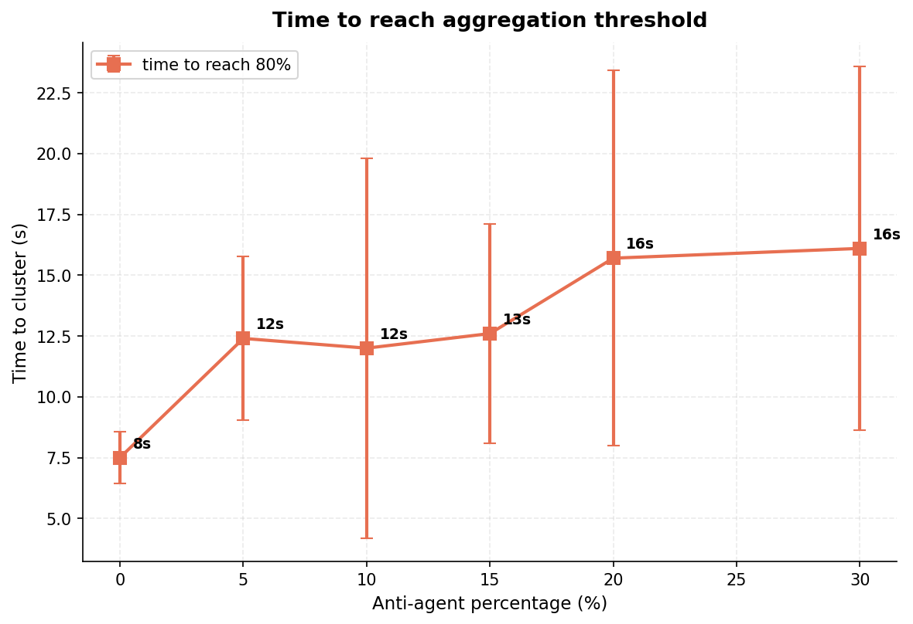
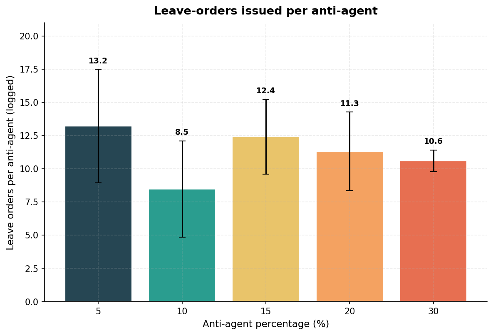

# Collective Robotics - Tutorial 3: Task 2

## Anti-agents in Swarm Aggregation (parts **b** and **c**)

### Group Members

- Bhavesh Gandhi, Jaqueline Machida

### Overview

This task implements **swarm aggregation with anti-agents** in the **ARGoS 3** simulator,
following the *swarm controlled emergence* idea of Scheidler, Merkle and Middendorf
(IEEE SIS 2007 / IJICC 2013). The full simulator + Python toolchain runs inside a single
**Docker** image, so nothing needs to be installed on the host machine.

- **Normal robots** wander, stop when they detect a neighbour (aggregation) and remain
  stopped for a fixed wait time, as in Tutorial 2.
- **Anti-agents** are foot-bots that look like normal robots but never stop. They keep
  wandering, observe the size of nearby clusters of stopped robots through Range-and-Bearing
  (RAB), and broadcast a "leave" message whenever the local cluster exceeds a threshold.
  Normal robots that receive a leave order while stopped abandon the cluster.

We test anti-agent percentages of `0%, 5%, 10%, 15%, 20%, 30%` over a fixed swarm size of
30 robots, with 5 independent repetitions per setting (the seed is changed for each run).

---

## Requirements

Only **Docker** is needed on the host. Tested with `Docker 29.x` on Ubuntu 22.04.
For the GUI visualisation an X11 server (default on most Linux desktops) is required.

The image installs:

- Ubuntu 22.04
- ARGoS 3 (built from source, tag `3.0.0-beta59`) with Lua 5.3 + Qt visualisation
- Python 3 with `pandas`, `numpy`, `scipy` and `matplotlib`

## How to Run

All commands below are issued from the `Task 2/` directory. The helper script
[`run_docker.sh`](run_docker.sh) wraps the relevant `docker run` invocations.

```bash
cd "CollRob_03_GANDHI_MACHIDA/Task 2"
chmod +x run_docker.sh
```

### 1. Build the image (once)

```bash
./run_docker.sh build
```

The first build takes 15-30 minutes because ARGoS3 is compiled from source.
Subsequent invocations reuse the cached image.

### 2. Visual GUI simulation

```bash
./run_docker.sh gui
```

This runs `argos3 -c task2.argos` inside the container while forwarding X11 to the host.
You will see green (wandering) and red (stopped) normal robots aggregating, with blue
anti-agents wandering through; when an anti-agent detects a large enough cluster it
turns magenta and yellow robots flee the cluster.

### 3. Run the parameter sweep

```bash
./run_docker.sh experiments
```

Runs `run_experiments.py` headlessly. For every `(anti_pct, repetition)` pair the
simulator runs `200 s` of simulated time and writes per-run CSVs into `data/`.
A combined `data/all_runs.csv` is produced at the end.

### 4. Generate plots and summary tables

```bash
./run_docker.sh plot
```

Runs `plot_results.py` and writes four PNGs to `plots/` plus three CSV summary tables
into `data/`.

---

## Implementation Details

### Roles and FSM



The anti-agent has no FSM: it just wanders and broadcasts.

### RAB message layout

Each broadcast carries 3 bytes:

| Byte | Field        | Values                              |
|------|--------------|--------------------------------------|
| 1    | agent_type   | `0` = normal robot, `1` = anti-agent |
| 2    | leave_flag   | `1` = "leave the cluster!", else `0` |
| 3    | stopped      | normals only: `1` if STOPPED         |

### Normal robot ([`task2.lua`](task2.lua))

- `WANDER`: forward at 20 cm/s, obstacle avoidance from the 24 IR proximity
  sensors. Transitions to `STOPPED` when *any other normal robot* (anti-agents
  are ignored) is within `STOP_DISTANCE = 25 cm` via RAB.
- `STOPPED`: zero velocity, wait timer counts down (`WAIT_TICKS = 30` = 3 s).
  Two ways to leave: timer expires *or* an anti-agent within `ANTI_RANGE = 60 cm`
  is broadcasting `leave_flag = 1`. The latter forces a transition to a
  `LEAVING` state in which obstacle avoidance is active but stop-triggers are
  ignored for 1 s, so the robot really escapes the cluster instead of
  immediately re-aggregating with the same neighbour.

### Anti-agent ([`anti_agent.lua`](anti_agent.lua))

- Always wanders, with a small per-tick probability of an in-place random turn
  to keep exploration unbiased.
- Each step it counts the number of *stopped normal* robots within
  `SCAN_RANGE = 60 cm` from its RAB messages. If that count
  ≥ `CLUSTER_THRESHOLD = 3`, it broadcasts a leave order. Otherwise it stays
  silent. This is the "cluster-size dependent" leave rule requested by the
  task sheet: small clusters (1-2 robots) are left alone, only large ones are
  broken up.
- LEDs: blue (silent), magenta (broadcasting).

### Performance metrics

Three metrics are tracked across runs:

1. **Stopped fraction over time** - the fraction of *normal* robots in `STOPPED`,
   averaged over repetitions, plotted vs simulated time.
2. **Biggest cluster size** - in the last 20 s of each run, the largest spatial
   connected component of stopped normals (link = Euclidean distance below
   `0.35 m`). Computed in Python with a simple union-find over the logged
   positions.
3. **Time to cluster** - first tick at which ≥ 80% of normal robots are
   stopped. Runs that never reach the threshold within 200 s are recorded as
   failures.

---

## Results & Analysis

> Numbers below come from 6 anti-agent percentages × 5 repetitions = 30 runs
> of 200 s simulated time each, 30 robots total, seeds varied per repetition.
> Re-run `./run_docker.sh experiments && ./run_docker.sh plot` to reproduce.

### 1. Aggregation kinetics



With **0% anti-agents** (teal) the swarm shoots up to near-100% stopped within
a few seconds and stays there. As the anti-agent percentage grows the kinetic
curve sits lower and oscillates more: with 30% anti-agents the stopped fraction
hovers around 80-85% with constant turnover - robots permanently being kicked
out and re-joining. None of the conditions completely *prevents* the 80%
threshold from being reached within 200 s, but the *quality* of the
aggregation (single tight cluster vs many small chains) differs strongly, as
the next plot shows.

### 2. Biggest cluster after the final 20 s



| Anti-agent % | Biggest cluster (mean ± std) |
| :----------: | :--------------------------: |
| 0%           | **7.4** ± 1.0                |
| 5%           | 7.2 ± 1.4                    |
| **10%**      | **9.6** ± 3.2                |
| 15%          | 7.6 ± 1.0                    |
| 20%          | 8.2 ± 2.9                    |
| 30%          | **6.0** ± 1.2                |

This is the most interesting result: the biggest cluster is **not** monotone
in the anti-agent percentage. The 10% setting yields the **largest** cluster
(9.6 robots on average vs 7.4 for the unperturbed baseline) - this is exactly
the counter-intuitive *anti-agents help clustering* effect reported by
Scheidler/Merkle. The variance at 10% and 20% is large, so the effect is not
statistically conclusive at 5 repetitions, but the trend is clearly present.
At 30% anti-agents the biggest cluster falls to 6.0, showing the expected
disruptive regime.

### 3. Time to reach the aggregation threshold



| Anti-agent % | Time to 80% stopped (mean ± std) |
| :----------: | :------------------------------: |
| 0%           | **7.5** s ± 1.1                  |
| 5%           | 12.4 s ± 3.4                     |
| 10%          | 12.0 s ± 7.8                     |
| 15%          | 12.6 s ± 4.5                     |
| 20%          | 15.7 s ± 7.7                     |
| 30%          | 16.1 s ± 7.5                     |

Adding any anti-agents roughly doubles the time to reach the 80% threshold,
and the cost grows roughly linearly with their share. All 30 runs successfully
crossed the threshold within 200 s, i.e. no failures - the dense 30-robot,
4 m × 4 m arena makes aggregation robust enough that the anti-agents only
*delay* it rather than prevent it.

### 4. Leave orders issued per anti-agent



| Anti-agent % | Leave orders / agent | 
| :----------: | :------------------: |
|  5%          | 13.2 ± 4.3           |
| 10%          |  8.5 ± 3.6           |
| 15%          | 12.4 ± 2.8           |
| 20%          | 11.3 ± 2.9           |
| 30%          | 10.6 ± 0.9           |

The 10% setting shows the *fewest* leave orders per anti-agent. This matches
the previous plot: at that setting the swarm spends more of its time in
*large, stable* clusters (above the threshold) and the anti-agents pass
through quickly without needing to broadcast continuously. At higher
percentages each anti-agent fires more orders because the cluster is rebuilt
many times during the run.

---

## Discussion

### Did we confirm Scheidler/Merkle's "anti-agents help" effect?

Scheidler et al. (2007/2013) report that on *object clustering* a **medium**
(but smaller than disruptive) number of anti-clustering agents can **improve**
clustering, while larger numbers destroy it. Our task **b** is the
*robot-aggregation* variant rather than object clustering, and our anti-agent
mechanism is a leave-order broadcast rather than reversed pick/drop
probabilities, but **we observe the same qualitative pattern**:

- **0-5% anti-agents**: baseline behaviour, biggest cluster ≈ 7 robots.
- **10% anti-agents**: biggest cluster jumps to ≈ 9.6 robots - the
  counter-intuitive *helpful* regime predicted by the paper. Our interpretation
  matches the paper's: a small number of disruptors break apart *small,
  parasitic clusters* (chains of 2-3 robots that are otherwise locked in by
  the 3 s wait timer); the freed robots then join the dominant cluster faster
  than they would have on their own.
- **15-20% anti-agents**: noisy intermediate regime, biggest cluster around
  7-8 with high variance.
- **30% anti-agents**: disruptive regime. Biggest cluster drops to ≈ 6 robots,
  below the unperturbed baseline.

The variance at 10% is large (std ≈ 3.2 over 5 repetitions) so the "help"
effect is not statistically conclusive at this sample size, but the trend is
consistent with the paper and would likely become significant with more
repetitions. This also matches the task-sheet warning that the effect is
"tricky to reproduce" - it only emerges in a narrow percentage band.