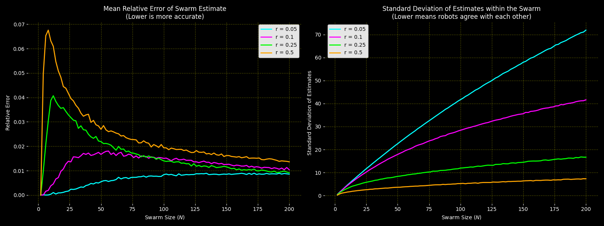

# Collective Robotics - Tutorial 3: Task 3

## Local Sampling in a Swarm

### Group Members

- Bhavesh Gandhi, Jaqueline Machida

### Overview

This task implements and analyzes a **local sampling** scenario in a simulated robot swarm. The swarm contains $N$ robots uniformly distributed over the unit square, where each robot is independently assigned one of two colors: black or white, with equal probability. A robot can only observe the colors of robots inside its local neighborhood, including itself. The neighborhood is defined by a sensor range $r$.

Each robot uses the local fraction of black robots in its neighborhood to estimate the total number of black robots in the full swarm:

$$\hat{B}_i = \frac{B_i^{\text{local}}}{N_i^{\text{local}}} \cdot N$$

where $\hat{B}_i$ is robot $i$'s estimate of the global number of black robots, $B_i^{\text{local}}$ is the number of black robots in its neighborhood, $N_i^{\text{local}}$ is the neighborhood size, and $N$ is the total swarm size.

We evaluate how swarm size and sensor range affect:

- The **mean relative error** of the swarm's average estimate.
- The **standard deviation of estimates within the swarm**, which measures how much individual robots agree or disagree with each other.

## Requirements

### Prerequisites & Operating System

- **OS**: Ubuntu 22.04 LTS, Windows, or any Python-compatible operating system
- **Python**: Python 3.7+
- **Python packages**: `numpy`, `matplotlib`, and `scipy`

### Python Environment Setup

It is recommended to use a virtual environment:

```bash
python3 -m venv collrob_env
source collrob_env/bin/activate
pip install numpy matplotlib scipy
```

On Windows PowerShell, the activation command is:

```powershell
.\collrob_env\Scripts\Activate.ps1
pip install numpy matplotlib scipy
```

## How to Run

Before running the simulation, make sure you are inside the `Task 3` directory:

```bash
cd "CollRob_03_GANDHI_MACHIDA/Task 3"
```

Run the local sampling experiment:

```bash
python3 task_3.py
```

The script performs 1000 independent experiments for each tested swarm size and sensor range, then saves the combined result plot:

- `plots/3_mean_error_and_std_vs_n.png`

## Implementation Details

### 1. Swarm Generation

For each experiment:

- Robot positions are sampled uniformly in the unit square:

$$x,y \in [0,1]$$

- Each robot is assigned a color:

$$\text{black} = 1,\quad \text{white} = 0$$

with equal probability.

The simulation tests swarm sizes:

$$N \in \{2,4,6,\ldots,200\}$$

and selected sensor ranges:

$$r \in \{0.05, 0.10, 0.25, 0.50\}$$

These values cover sparse local sensing, medium-range sensing, and large-range sensing within the assignment range $r \in [0.02, 0.5]$.

### 2. Neighborhood Detection

Pairwise distances between all robots are computed using `scipy.spatial.distance.cdist`. Robot $j$ belongs to robot $i$'s neighborhood if:

$$d(i,j) < r$$

The robot itself is included in its own neighborhood because its distance to itself is zero.

### 3. Local Estimate

Each robot estimates the global number of black robots by scaling up its local black ratio:

$$\hat{B}_i = p_i^{\text{local}}N$$

where

$$p_i^{\text{local}} = \frac{B_i^{\text{local}}}{N_i^{\text{local}}}$$

For each independent experiment, the script computes:

- The average estimate over all robots in the swarm.
- The relative error between this average estimate and the actual number of black robots.
- The standard deviation of the individual robot estimates.

The final plotted values are averaged over 1000 repetitions for each $(N,r)$ setting.

## Results & Analysis

### Mean Error and Estimate Disagreement



### 1. Mean Relative Error of the Swarm Estimate

#### Observations

- For very small sensor range, $r = 0.05$, the mean relative error stays low and increases only slightly as $N$ grows.
- For larger ranges such as $r = 0.25$ and $r = 0.50$, the error is higher for small and medium swarm sizes, then gradually decreases as $N$ increases.
- The largest sensor range, $r = 0.50$, shows a sharp early error peak for small $N$, reaching roughly $0.07$, then decreases toward about $0.014$ by $N = 200$.
- For $r = 0.10$, the error rises at first and then slowly decreases, remaining between the very local and the large-radius cases.

#### Interpretation

The low error for $r = 0.05$ may seem surprising, but it follows from how the swarm average is computed. With a very small sensor range, many robots observe only themselves or a very small neighborhood. Individual estimates become extreme, often close to either $0$ or $N$, but when all robot estimates are averaged together, these extremes can cancel out and recover the global black fraction well.

Larger sensor ranges produce estimates based on more neighbors, but for finite swarm sizes the local neighborhoods are still affected by random spatial clustering and boundary effects. These effects are strongest at small $N$, where a few local color imbalances can noticeably bias the average estimate.

#### Key Finding

The mean swarm-level estimate can be accurate even when individual robots have poor local information. Therefore, low average error alone is not enough to guarantee that the swarm has reliable distributed knowledge.

---

### 2. Standard Deviation of Estimates Within the Swarm

#### Observations

- The standard deviation increases with swarm size for all sensor ranges.
- The smallest sensor range, $r = 0.05$, produces the largest disagreement between robots. By $N = 200$, the standard deviation rises above $70$.
- For $r = 0.10$, the standard deviation is lower than $r = 0.05$ but still grows strongly, reaching above $40$ at $N = 200$.
- For $r = 0.25$, the standard deviation is much smaller, ending around the mid-to-high teens at $N = 200$.
- The largest range, $r = 0.50$, gives the lowest disagreement, staying below roughly $8$ even at $N = 200$.

#### Interpretation

The standard deviation plot shows how consistent the robots are with each other. Small sensor ranges create highly local and noisy estimates: one robot may see mostly black robots, while another may see mostly white robots. As a result, their estimates of the global number of black robots differ greatly.

Increasing $r$ makes each robot's neighborhood larger and more representative of the whole swarm. This reduces disagreement because robots base their estimates on more overlapping information. In the limit of very large sensing range, every robot would observe almost the same population and produce nearly identical estimates.

#### Key Finding

Large sensor ranges improve agreement between robots. This is important for swarm behaviors where each robot must independently make decisions based on its own estimate, rather than relying on a centralized average.

## Discussion

### 1. Accuracy vs Agreement Trade-off

The two plots reveal a trade-off between global average accuracy and local consistency:

- Small $r$ can produce a good **swarm-average** estimate because individual errors cancel out.
- Large $r$ produces better **individual agreement** because robots observe larger and more representative neighborhoods.

This distinction matters in real swarm systems. If the final output is computed by averaging all robots' estimates centrally, small sensor ranges may appear sufficient. However, if each robot must act independently, then high disagreement can lead to inconsistent decisions across the swarm.

### 2. Effect of Swarm Size

Increasing $N$ improves the statistical reliability of local sampling in larger neighborhoods because more robots become available as samples. For $r = 0.25$ and $r = 0.50$, the mean relative error decreases as $N$ becomes large. However, the standard deviation of absolute estimates can still increase with $N$ because the estimate itself is scaled by $N$.

In other words, even if the estimated fraction of black robots becomes more stable, the estimated count of black robots can vary more in absolute terms as the swarm size grows.

### 3. Consequences for Real Swarm Robotics

For a robot swarm whose effectiveness depends on local sampling, the sensor range should be chosen based on the type of decision being made:

- If robots only need a rough collective estimate, short-range sensing may be acceptable.
- If each robot must make reliable individual decisions, larger sensor ranges are preferable.
- If sensing is expensive or limited, the swarm may need communication or consensus mechanisms to reduce disagreement.

A practical swarm implementation should therefore not evaluate only the mean error. It should also evaluate how much estimates vary between robots, because local disagreement can produce unstable or conflicting behaviors.

## Conclusions

1. **Local Sampling Works Statistically**: Robots can estimate the global number of black robots using only local neighborhood information.
2. **Sensor Range Strongly Affects Reliability**: Larger sensor ranges reduce disagreement between robots by giving each robot a more representative sample.
3. **Mean Error Alone Is Misleading**: Very small sensor ranges can have low swarm-average error while still producing highly inconsistent individual estimates.
4. **Swarm Size Changes the Error Structure**: Larger swarms improve statistical sampling for broad neighborhoods, but absolute estimate disagreement can still grow because estimates scale with $N$.
5. **Design Implication**: For decentralized swarm behavior, sensor range and communication strategy must be chosen to balance sensing cost, estimate accuracy, and agreement between individual robots.
