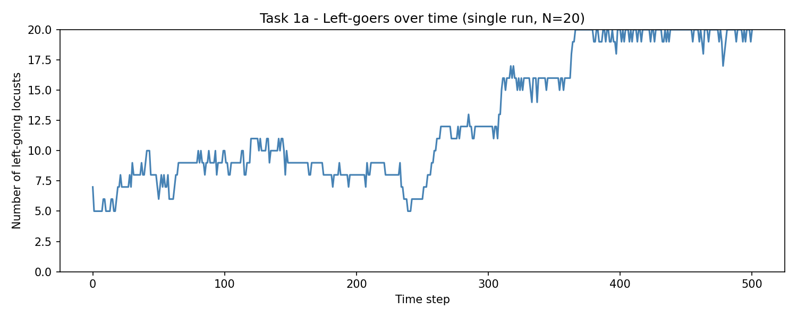
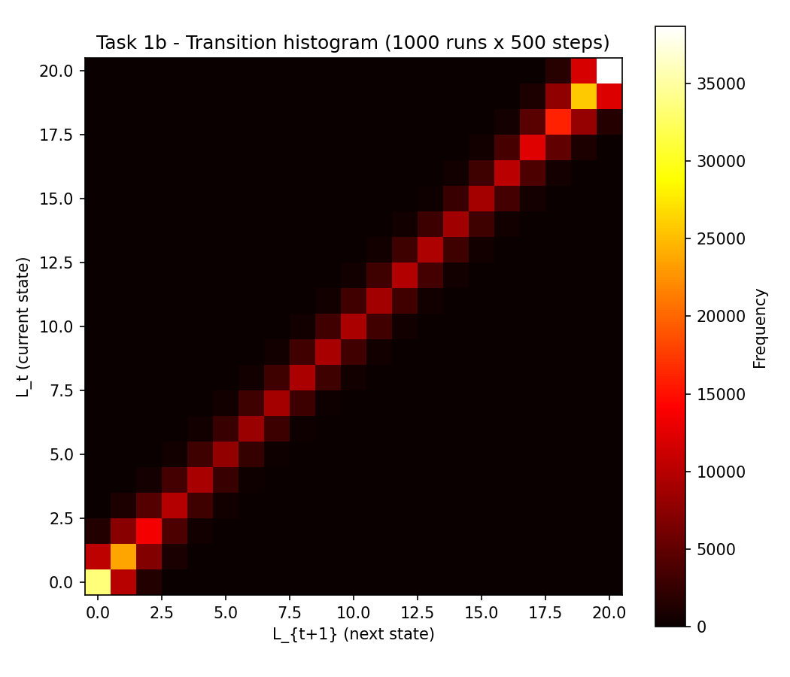
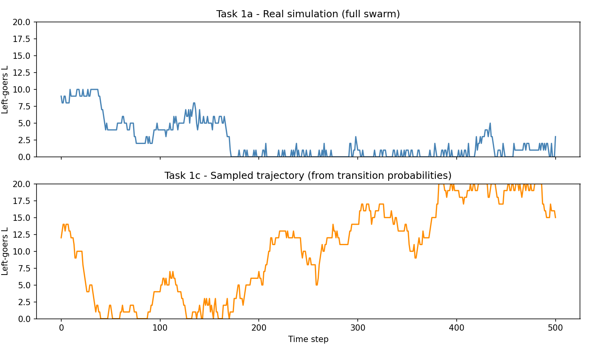

# Collective Robotics - Tutorial 4: Task 1

## Dimension Reduction and Modeling

### Group Members

- Bhavesh Gandhi, Jaqueline Machida

### Overview

This task implements the continuous-space, discrete-time locust swarm model and then reduces it to a one-dimensional stochastic model. The full system tracks the position and direction of every locust on a ring, while the reduced model keeps only one macroscopic state variable:

$$L_t = \text{number of left-going locusts at time } t.$$

The assignment has three parts:

- Simulate the full swarm and plot the number of left-going locusts over time for one run.
- Use 1000 full simulations of 500 time steps each to build a transition histogram for observed transitions $L_t \rightarrow L_{t+1}$.
- Normalize the histogram into transition probabilities $P_{i,j}$ and use this reduced transition model to sample a new trajectory of $L_t$.

## Requirements

### Prerequisites & Operating System

- **OS**: Ubuntu 22.04 LTS, Windows, or any Python-compatible operating system
- **Python**: Python 3.7+
- **Python packages**: `numpy` and `matplotlib`

### Python Environment Setup

It is recommended to use a virtual environment before running the scripts:

```bash
python3 -m venv collrob_env
source collrob_env/bin/activate
pip install numpy matplotlib
```

On Windows PowerShell, the activation command is:

```powershell
.\collrob_env\Scripts\Activate.ps1
pip install numpy matplotlib
```

## How to Run

Before running any commands, make sure you are inside the Task 1 directory:

```bash
cd "CollRob_04_GANDHI_MACHIDA/task_1"
```

### 1. Full Locust Swarm Simulation

To run one full swarm simulation and plot the number of left-going locusts:

```bash
python3 task_1a.py
```

This script saves:

- `plots/task_1a.png`

### 2. Transition Histogram

To run 1000 simulations of 500 time steps and build the transition histogram:

```bash
python3 task_1b.py
```

This script saves:

- `plots/task_1b.png`

### 3. Reduced Transition Model

To normalize the transition histogram and sample a trajectory from the reduced model:

```bash
python3 task_1c.py
```

This script saves:

- `plots/task_1c.png`

## Implementation Details

### 1. Full Swarm Model

The simulation uses the assignment parameters:

- Number of locusts: $N = 20$
- Ring circumference: $C = 1$
- Speed: $v = 0.001$
- Perception range: $r = 0.045$
- Spontaneous switching probability: $P = 0.015$
- Simulation length: $T = 500$ time steps

Each locust has a position on the ring and a direction, either left-going $(-1)$ or right-going $(+1)$. Initial positions are sampled uniformly on $[0,1)$ and initial directions are sampled with equal probability.

At each time step, every locust checks the other locusts within perception range using the shortest arc distance on the ring. A locust switches direction if the majority of its local neighbors move in the opposite direction. Independently of this interaction rule, it may also switch direction spontaneously with probability $0.015$.

After the direction updates, positions are advanced by one speed step and wrapped around the ring using modulo arithmetic.

### 2. Dimension Reduction

The full swarm state contains all locust positions and directions, so it is high-dimensional. For the reduced model, only the number of left-going locusts is retained:

$$L_t \in \{0,1,\ldots,20\}.$$

This means many different microscopic swarm configurations are grouped into the same reduced state if they have the same number of left-going locusts. The reduced model therefore ignores spatial arrangement and keeps only the transition statistics of $L_t$.

### 3. Transition Histogram and Transition Probabilities

For each observed transition $L_t \rightarrow L_{t+1}$, the corresponding histogram entry is increased:

$$A[L_t][L_{t+1}] \leftarrow A[L_t][L_{t+1}] + 1.$$

With 1000 runs and 500 transitions per run, the histogram is built from 500,000 observed transitions. The state occurrence count for state $i$ is the row sum:

$$M[i] = \sum_j A[i][j].$$

The transition probability matrix is then estimated as:

$$P_{i,j} = \frac{A[i][j]}{M[i]}.$$

Rows with observations are normalized to sum to 1, so each row can be used as a categorical distribution for sampling the next reduced state.

## Results & Analysis

### 1. Full Simulation



#### Observations

- The number of left-going locusts changes over time due to local majority interactions and spontaneous direction switching.
- The trajectory is noisy because the model is stochastic and because $N = 20$ is a relatively small swarm.
- Periods with many left-going or many right-going locusts can appear when local alignment causes groups to reinforce a dominant direction.
- The plot satisfies Task 1a by showing one complete 500-step run of the original continuous-space swarm model.

#### Key Finding

The full simulation behaves as expected: the macroscopic variable $L_t$ fluctuates over time while remaining bounded between 0 and 20. This provides the raw dynamics that are later summarized by the reduced model.

---

### 2. Transition Histogram



#### Observations

- The histogram records how often each transition $L_t \rightarrow L_{t+1}$ appears across 1000 simulations.
- Most high-frequency transitions lie near the diagonal, which means $L_{t+1}$ is usually close to $L_t$ after only one time step.
- Larger jumps are less common because a single time step usually changes only a few locust directions.
- The histogram covers all possible reduced states $L \in \{0,\ldots,20\}$, but the frequencies are not uniform because some swarm-level states occur more often than others.

#### Key Finding

The histogram captures the empirical one-step dynamics of the reduced variable $L$. It is the central bridge between the full spatial swarm simulation and the one-dimensional stochastic model.

---

### 3. Reduced Model Trajectory



#### Observations

- The upper plot shows a trajectory from the original full swarm simulation.
- The lower plot shows a trajectory sampled only from the learned transition probabilities $P_{i,j}$.
- The reduced trajectory has a similar macroscopic scale: it remains in the valid range from 0 to 20 and changes gradually over time.
- The sampled trajectory is not expected to match the full simulation exactly, because it does not know the locust positions or local neighborhood structure.

#### Comparison with Task 1a

The reduced model reproduces the coarse behavior of the number of left-going locusts, but it discards spatial information. In the full model, the next value of $L_t$ depends on where the locusts are located on the ring and which neighbors they can perceive. In the reduced model, all configurations with the same value of $L_t$ are treated as equivalent.

Because of this, the reduced model is useful for describing average one-step transition behavior, but it cannot preserve all correlations and memory effects from the original swarm. The comparison plot therefore shows a reasonable qualitative match rather than an identical trajectory.

#### Key Finding

The one-dimensional model is a successful dimension reduction for the assignment goal: it produces plausible evolutions of $L_t$ using only empirical transition probabilities learned from the full simulation.

