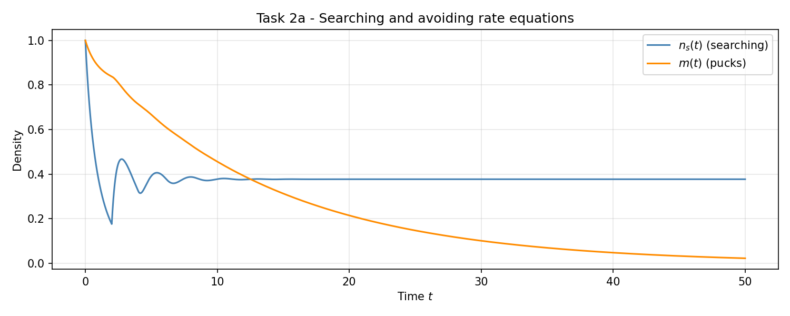
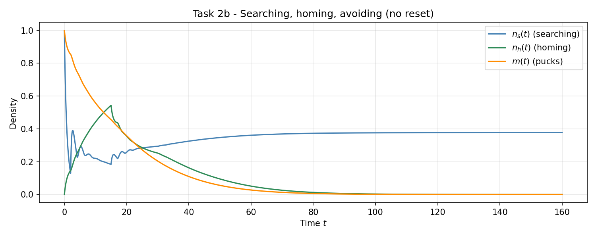
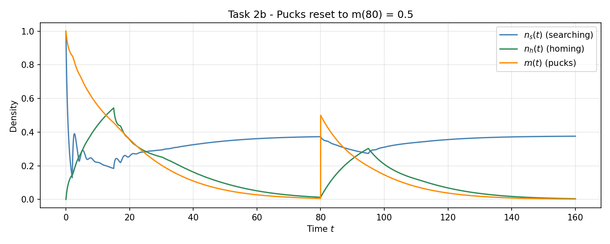

# Collective Robotics - Tutorial 4: Task 2

## Rate Equations

### Group Members

- Bhavesh Gandhi, Jaqueline Machida

### Overview

This task models a foraging swarm at the macroscopic level using a small system of delay differential equations (DDEs). The robots switch between behavioral states, and the densities of robots in each state are tracked over time together with the puck density $m(t)$.

The assignment has two parts:

- **Task 2a**: integrate the searching/avoiding rate equations and interpret the result.
- **Task 2b**: add a third state *homing* with delay $\tau_h$, simulate the extended system, then repeat with a puck reset $m(80) = 0.5$.

## Requirements

### Prerequisites & Operating System

- **OS**: Ubuntu 22.04 LTS, Windows, or any Python-compatible operating system
- **Python**: Python 3.7+
- **Python packages**: `numpy` and `matplotlib`

### Python Environment Setup

It is recommended to use a virtual environment before running the scripts:

```bash
python3 -m venv collrob_env
source collrob_env/bin/activate
pip install numpy matplotlib
```

On Windows PowerShell, the activation command is:

```powershell
.\collrob_env\Scripts\Activate.ps1
pip install numpy matplotlib
```

## How to Run

Before running any commands, make sure you are inside the Task 2 directory:

```bash
cd "CollRob_04_GANDHI_MACHIDA/task_2"
```

### 1. Searching and Avoiding

```bash
python3 task_2a.py
```

This script saves:

- `plots/task_2a.png`

### 2. Extended Model with Homing

```bash
python3 task_2b.py
```

This script saves:

- `plots/task_2b_no_reset.png`
- `plots/task_2b_reset.png`

## Implementation Details

### 1. Numerical Method

Both scripts integrate the system with explicit forward Euler using a fixed step size $\Delta t = 0.01$. With delays of $\tau_a = 2$ and $\tau_h = 15$ this gives 200 and 1500 buffered samples respectively, which is enough resolution for the small time constants involved and stays well inside the Euler stability region.

The full state history is kept in plain arrays. For a query at $t - \tau$ the script simply indexes into the buffer at $k - \lfloor \tau / \Delta t \rfloor$.

### 2. Handling the Delays for $t < \tau$

For early times the delayed value $n_s(t - \tau)$ refers to a moment before the simulation started. We use the *no-history* convention: any delayed term whose argument is negative is set to zero. Physically this matches the interpretation of $\tau_a$ and $\tau_h$ as durations spent in avoidance or homing — if no robot has had time to enter that state yet, nobody returns from it either. This avoids a non-physical mass injection during the warm-up phase $t \in [0, \tau)$.

### 3. Task 2a Equations

$$\frac{dn_s}{dt} = -\alpha_r\, n_s(t)\bigl(n_s(t) + 1\bigr) + \alpha_r\, n_s(t - \tau_a)\bigl(n_s(t - \tau_a) + 1\bigr)$$

$$\frac{dm}{dt} = -\alpha_p\, n_s(t)\, m(t)$$

with $\alpha_r = 0.6$, $\alpha_p = 0.2$, $\tau_a = 2$, $n_s(0) = m(0) = 1$.

The first equation is mass-conserving for the searching/avoiding population: every robot that leaves searching due to a collision returns exactly $\tau_a$ time units later.

### 4. Task 2b Equations

A third state *homing* ($n_h$) is added. When a searching robot finds a puck (rate $\alpha_p n_s m$) it transitions to homing and stays there for exactly $\tau_h = 15$ before returning to searching. Homing robots are assumed not to interfere with anyone else.

$$\frac{dn_s}{dt} = -\alpha_r\, n_s(t)\bigl(n_s(t)+1\bigr) + \alpha_r\, n_s(t-\tau_a)\bigl(n_s(t-\tau_a)+1\bigr) - \alpha_p\, n_s(t)\, m(t) + \alpha_p\, n_s(t-\tau_h)\, m(t-\tau_h)$$

$$\frac{dn_h}{dt} = \alpha_p\, n_s(t)\, m(t) - \alpha_p\, n_s(t-\tau_h)\, m(t-\tau_h)$$

$$\frac{dm}{dt} = -\alpha_p\, n_s(t)\, m(t)$$

Note that the puck equation is unchanged: only searching robots collect pucks. The puck-pickup term appears with the same sign in $\dot n_s$ and $\dot n_h$ (negative and positive respectively), and the delayed return term is the symmetric pair.

For the second run of Task 2b, the puck density is reinitialized at $t = 80$ to $m(80) = 0.5$. This is implemented as a hard override of $m$ at the time step nearest to $t = 80$. The histories of $n_s$ and $m$ used by the delay buffer are *not* rewritten, so the simulation continues to use the actual past values when evaluating $n_s(t-\tau_h)\,m(t-\tau_h)$. That is consistent with the interpretation of the reset as a new puck supply suddenly appearing — robots that left in the past still come home with their old pucks.

## Results & Analysis

### 1. Task 2a - Searching and Avoiding



#### Observations

- $n_s$ drops sharply during the first $\tau_a = 2$ time units because collisions remove searchers and no avoiders have returned yet.
- After $t = \tau_a$ the delayed return term switches on and $n_s$ rebounds. The collision rate then increases again, causing damped oscillations with period $\approx 2 \tau_a$.
- The oscillations decay and $n_s$ approaches a fixed value around $0.378$. At equilibrium the rate of robots entering avoidance equals the rate returning, which is automatic for this constant delay model once $n_s$ is constant over a window of length $\tau_a$.
- $m(t)$ decays monotonically and roughly exponentially because $n_s$ stabilizes and $\dot m = -\alpha_p n_s m$ behaves like a linear decay with effective rate $\alpha_p \cdot n_s^{\,*} \approx 0.076$.

#### Key Finding

The delay $\tau_a$ produces the characteristic ringing of a DDE. The equilibrium value of $n_s$ is set by the balance between current collisions and delayed returns, not by the initial density. Puck depletion is driven entirely by the (slower) constant rate of searchers in steady state.

---

### 2. Task 2b - Searching, Homing, Avoiding (no reset)



#### Observations

- Within the first few seconds the same fast avoidance oscillations as in Task 2a appear in $n_s$.
- $n_h$ grows from zero and reaches its first maximum near $t = \tau_h = 15$. Up to that point no robots have returned from homing yet, so $n_h$ accumulates everything that left $n_s$ via the puck-pickup term.
- After $t = \tau_h$ the delayed return term activates and $n_h$ stops growing as fast. The peak height ($\approx 0.55$) is essentially the integral of the pickup flux over one full $\tau_h$ window.
- $m(t)$ decays smoothly. Once $m$ approaches zero, the pickup term vanishes, so robots stop entering homing. The robots already in $n_h$ keep returning to searching with delay $\tau_h$, which is why $n_h$ tails off slowly while $n_s$ climbs back to the avoidance-only equilibrium $\approx 0.38$ (same value as in Task 2a, since with no pucks the system reduces to Task 2a).

#### Key Finding

The homing state acts as a long-time-constant buffer for robots: it stores them for $\tau_h$ and releases them back into searching. Because the puck supply is finite and depletes, the buffer eventually drains and the system settles into the same searching/avoiding equilibrium as Task 2a.

---

### 3. Task 2b - Pucks Reset to $m(80) = 0.5$



#### Observations

- Up to $t = 80$ the trajectory is identical to the previous run. By that time $n_h$ and $m$ have decayed to near zero and the swarm is mostly searching.
- The reset injects pucks instantaneously at $t = 80$: $m$ jumps from a small value to $0.5$.
- The pickup term $\alpha_p n_s m$ becomes large again, so $n_s$ drops and $n_h$ rises a second time. The second homing peak is smaller than the first because the available puck mass is smaller ($0.5$ vs. $1.0$) and because $n_s$ at $t=80$ is below its initial value.
- The second peak in $n_h$ occurs roughly $\tau_h = 15$ time units after the reset, just like the first peak occurred at $t \approx \tau_h$.
- The system again converges back to the pure-searching/avoiding equilibrium once pucks are depleted.

#### Key Finding

The model responds correctly to a sudden environmental change: a new batch of pucks reactivates the homing dynamics, with the same delay structure as the original run but at a smaller amplitude. This shows that the rate-equation model handles non-stationary external inputs as long as the delay buffers are kept consistent, and that the long-term equilibrium of the closed (no-puck) sub-system is a stable attractor of the full model.
