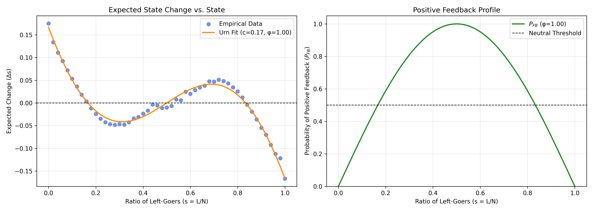

# Collective Robotics - Tutorial 5: Task 1

## Urn Model for Locust Scenario

### Group Members

- Bhavesh Gandhi, Jaqueline Machida

### Overview

This task implements an empirical approach to evaluate how well a macroscopic
theoretical model, the urn model, represents the microscopic agent-based reality
of a locust swarm simulation.

The simulation uses $N = 50$ locusts on a continuous one-dimensional ring. The
locusts follow local majority rules and can also switch direction
spontaneously. We run 5000 independent simulations, allow 100 time steps for the
swarm to organize, and then measure the one-step change

$$\Delta L = L_t - L_{t-1}$$

over the following 20 time steps. The resulting data are binned by the previous
state $L_{t-1}$ and used to estimate the empirical function $\Delta L(L)$.

The assignment has three parts:

- Measure and plot the empirical function $\Delta L(L)$ and interpret the roots
  $L^*$ where $\Delta L(L^*) = 0$.
- Fit the theoretical urn model to the measured data by estimating the scaling
  constant $c$ and the feedback intensity $\varphi$.
- Plot the empirical data, the fitted urn model, and the resulting probability
  of positive feedback $P_{FB}$.

## Requirements

### Prerequisites & Operating System

- **OS**: Ubuntu 22.04 LTS, Windows, or any Python-compatible operating system
- **Python**: Python 3.7+
- **Python packages**: `numpy`, `matplotlib`, `scipy`, and `tqdm`

### Python Environment Setup

It is recommended to use a virtual environment before running the script:

```bash
python3 -m venv collrob_env
source collrob_env/bin/activate
pip install numpy matplotlib scipy tqdm
```

On Windows PowerShell, the activation command is:

```powershell
.\collrob_env\Scripts\Activate.ps1
pip install numpy matplotlib scipy tqdm
```

## How to Run

Before running the command, make sure you are inside the Task 1 directory:

```bash
cd "CollRob_05_GANDHI_MACHIDA/task_1"
```

### 1. Urn Model Analysis

To collect the empirical data, fit the urn model, and generate the result
figure:

```bash
python3 task_1.py
```

On Windows, depending on the Python installation, the equivalent command may be:

```powershell
python task_1.py
```

This script saves:

- `plots/urn_model_analysis.png`

It also prints the fitted parameters:

- Scaling constant $c \approx 0.1666$
- Feedback intensity $\varphi \approx 1.0000$

## Implementation Details

### 1. Empirical Data Collection

The simulation uses the Tutorial 5 locust parameters:

- Number of locusts: $N = 50$
- Ring circumference: $C = 0.5$
- Speed: $v = 0.01$
- Perception range: $r = 0.045$
- Spontaneous switching probability: $P = 0.15$
- Burn-in period: 100 time steps
- Observation period: 20 time steps
- Number of independent runs: 5000

For each run, the first 100 time steps are used as a burn-in period so that the
swarm can settle into an organized collective pattern. During the following
20 time steps, the code records each transition from $L_{t-1}$ to $L_t$ and
computes

$$\Delta L = L_t - L_{t-1}.$$

The measured $\Delta L$ values are grouped according to their previous state
$L_{t-1}$. For every possible state $L \in \{0,\ldots,50\}$, the script stores
the sum of observed changes and the number of visits to that state. The
empirical mean is then

$$\Delta L(L) = \frac{\text{sum of observed one-step changes from } L}
{\text{number of visits to } L}.$$

States that are not visited are ignored during the curve fitting stage.

### 2. Meaning of the Roots $L^*$

When plotting the empirical function $\Delta L(L)$, we look for roots denoted
as $L^*$, where

$$\Delta L(L^*) = 0.$$

#### Mathematical Meaning

The positions $L^*$ represent the fixed points, or equilibria, of the averaged
dynamical system. At these states, the expected one-step change is zero, meaning
the macroscopic state $L$ is stationary on average.

If the curve crosses the zero axis with a negative slope,

$$\frac{d(\Delta L)}{dL} < 0,$$

then the fixed point is a stable equilibrium, or attractor. A small perturbation
away from $L^*$ creates an average change that pushes the system back toward
$L^*$.

If the curve crosses the zero axis with a positive slope,

$$\frac{d(\Delta L)}{dL} > 0,$$

then the fixed point is an unstable equilibrium, or repeller. A small
perturbation causes the system to move farther away from that state.

#### Domain-Specific Meaning

In the locust swarm, the unstable equilibrium lies at the unpolarized 50/50
split,

$$s = 0.5 \quad \text{or} \quad L = 25.$$

A perfectly divided swarm cannot maintain this state. Any slight imbalance
triggers positive feedback and rapidly pushes the swarm toward one of the two
polarized states.

The stable attractors exist near the edges, roughly around 15% and 85% of the
swarm moving left. These represent cohesive organized states where the swarm has
committed to a collective direction.

### 3. Urn Model Fitting

The theoretical urn model is fitted to the collected empirical data to test
whether the macroscopic equation accurately describes the swarm behavior. The
state variable is converted from the number of left-going locusts $L$ to the
ratio of left-goers:

$$s = \frac{L}{N}.$$

The measured response is converted in the same way:

$$\Delta s = \frac{\Delta L}{N}.$$

The positive feedback probability is modeled as

$$P_{FB}(s,\varphi) = \varphi \sin(\pi s).$$

The expected average change is

$$\Delta s(s) =
4c \left(P_{FB}(s,\varphi) - \frac{1}{2}\right)
\left(s - \frac{1}{2}\right).$$

SciPy's curve optimization is used to fit the scaling constant $c$ and the
feedback intensity $\varphi$. The fit constrains $\varphi$ to the realistic
probability interval $[0,1]$.

Over 5000 independent simulation runs, the empirical data yielded the following
optimal parameters:

- **Scaling constant ($c$):** 0.1666
- **Feedback intensity ($\varphi$):** 1.0000

## Results & Analysis

### Subtask a: Empirical $\Delta L(L)$ and Meaning of $L^*$



#### Answer

The empirical function $\Delta L(L)$ is shown in the left panel of the figure.
The roots $L^*$ are the states where

$$\Delta L(L^*) = 0.$$

These roots are fixed points of the averaged swarm dynamics. Mathematically,
they are states where the expected one-step change is zero. In the locust
scenario, the middle fixed point near $L = 25$ is unstable because it represents
an unpolarized 50/50 split. The swarm does not remain there after a small
perturbation. The stable fixed points are near the polarized states, roughly
around 15% and 85% of the swarm moving left, where the swarm has committed to a
collective direction.

#### Observations

- The empirical data align very well with the fitted macroscopic urn model.
- The expected change curve captures the stable and unstable equilibria of the
  swarm-level dynamics.
- The unstable equilibrium lies near the symmetric state $s = 0.5$, or
  $L = 25$.
- The stable attractors lie closer to the two polarized swarm states.

#### Key Finding

The theoretical curve closely tracks the empirical data points, validating the
presence and locations of the stable and unstable equilibria discussed above.
This shows that the simple mathematical formulation of the urn model captures
the emergent behavior produced by the microscopic agent-based simulation.

---

### Subtask b: Fitted Urn Model Parameters

#### Answer

The urn model was fitted after converting the data from absolute counts to
ratios:

$$s = \frac{L}{N}, \qquad \Delta s = \frac{\Delta L}{N}.$$

The fitted model is

$$P_{FB}(s,\varphi) = \varphi \sin(\pi s),$$

$$\Delta s(s) =
4c \left(P_{FB}(s,\varphi) - \frac{1}{2}\right)
\left(s - \frac{1}{2}\right).$$

Using SciPy curve optimization with $0 \le \varphi \le 1$, the fitted values
were:

- **Scaling constant ($c$):** 0.1666
- **Feedback intensity ($\varphi$):** 1.0000

#### Key Finding

The fitted value $\varphi = 1.0$ reaches the upper bound of the allowed
probability range. This means the empirical swarm behavior is best explained by
the strongest positive-feedback profile allowed by the urn model.

---

### Subtask c: Data, Fit, and Positive Feedback Probability

#### Answer

The optimized feedback intensity $\varphi = 1.0$ means that positive feedback is
maximal when the swarm is completely unorganized, at $s = 0.5$. At this point,
individual locusts experience the strongest possible tendency to align with
their neighbors.

The right panel of the figure shows the resulting positive feedback profile
$P_{FB}(s,\varphi)$. Because $\varphi = 1.0$, the curve peaks at
$P_{FB} = 1.0$ when $s = 0.5$ and falls toward zero near $s = 0$ and $s = 1$.

#### Key Finding

The maximum fitted value of $\varphi$ indicates that the collective
decision-making of the simulated locusts is strongly dominated by the local
majority rule. The spontaneous switching probability of 15% introduces noise,
but it does not remove the strong positive feedback that drives the swarm toward
one of the two polarized collective states.

---

### Overall Conclusion

The urn model is a successful macroscopic description of the simulated locust
swarm. It reproduces the average one-step state changes and explains why the
swarm tends to leave the unpolarized state and settle near polarized collective
directions. The unstable fixed point at $L = 25$ acts as the barrier between the
two collective directions, while the stable attractors near the edges represent
organized swarm motion.
